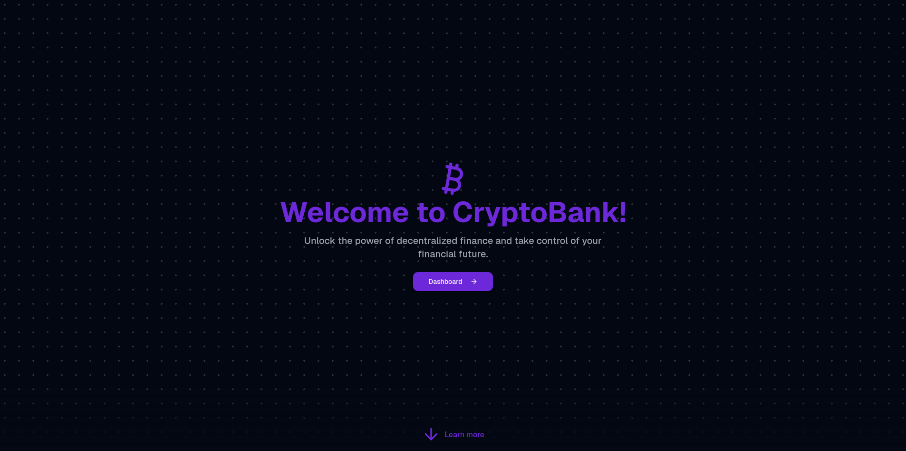

# Blockchain



## Development
### Setup

- Setup Postgres
```bash
docker-compose up -d
```

- Run the project
```bash
bun run dev
```

### Tests
```bash
bun test
```

## TODO
- Remove aws sdk and only use bun APIS for s3
